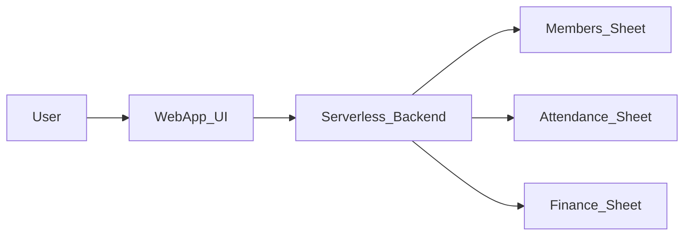

## 1. Overview & Context

### 1.1 Product Name

**Product name**: Simple Church Management System (SCMS)

### 1.2 Summary

The Simple Church Management System (SCMS) is a lightweight, serverless web application that helps a church track its members and monthly finances without maintaining its own database infrastructure. All data is stored using Google services (Google Sheets / Google Cloud Storage via CSV files), making it easy for non-technical staff to view and edit data directly in familiar tools while allowing the web app to provide a friendly interface on top.

### 1.3 Goals

- **Member information management**: Provide a simple way to store, view, and update church member information (e.g., name, birthdate, age, join date, attendance records, and other key attributes) in a CSV that is connected to Google Sheets.
- **Attendance tracking**: Allow basic tracking of member attendance over time in a structured way that can be viewed and updated via the web app and Sheets.
- **Simple monthly finance tracking**: Enable recording of church finances (money in and money out) each month, with simple summaries for leadership (e.g., total income, total expenses, net per month).
- **Serverless, low-maintenance setup**: Use a serverless architecture, with data stored through Google storage/Sheets, to minimize operational overhead.

### 1.4 Non-Goals (Out of Scope for MVP)

- Full accounting system (e.g., double-entry bookkeeping, tax reporting, depreciation).
- Complex multi-church hierarchy or multi-tenant setup (MVP is for a single church).
- Native mobile applications (only a responsive web app is in scope).
- Advanced analytics, dashboards, or BI tooling beyond simple summaries.
- Built‑in communication tools (e.g., mass email/SMS, push notifications).
- Volunteer scheduling, small group management, or event ticketing beyond basic attendance tracking.

---

## 2. Users & Use Cases

### 2.1 User Personas

- **Church Administrator**
  - Primary person responsible for maintaining member records and financial entries.
  - Comfortable with basic web tools and spreadsheets.
- **Pastor / Church Leadership**
  - Needs to quickly see high-level information (e.g., total members, attendance patterns, monthly financial summary).
  - May occasionally view details but does not typically maintain data.
- **Staff / Volunteer**
  - May assist with checking in people and marking attendance.
  - May contribute to updating limited member information (e.g., contact details) if granted access.

### 2.2 Primary Use Cases

- **Member Management**
  - Add a new member with basic demographic and membership information.
  - View a list of members, filter by simple criteria (name, age range, join date, active/inactive).
  - Update existing member details (e.g., name spelling, birthdate, join date, status).
  - View a single member’s profile, including recent attendance information.
- **Attendance Tracking**
  - For a given service or date, mark which members attended.
  - For a given member, view their attendance history over a time range.
  - Export or view attendance data in Google Sheets for further manual analysis if needed.
- **Finance Tracking**
  - For each month, record income entries (e.g., tithes, offerings, donations) with date, amount, category, and notes.
  - For each month, record expense entries (e.g., rent, utilities, salaries) with date, amount, category, and notes.
  - View a monthly summary of finances:
    - Total money in.
    - Total money out.
    - Net (money in − money out).
- **Administration**
  - Configure access to the application (e.g., admin vs. read-only users).
  - Export CSV snapshots (if needed) for backup or offline analysis.

---

## 3. Functional Requirements

### 3.1 Member Management

- **FR-1: Member creation**
  - The system shall allow an admin user to create a new member record with at least the following fields:
    - Unique member ID (system-generated).
    - Full name.
    - Birthdate.
    - Age (either stored explicitly or derived from birthdate).
    - Join date.
    - Status (e.g., Active, Inactive).
    - Optional notes (free text).
  - New records shall be persisted to the Members CSV, which is connected to a Google Sheet.
- **FR-2: Member viewing**
  - The system shall display a paginated/sortable list of members with key columns (name, age, join date, status).
  - The system shall allow viewing a detailed member profile, including the member’s basic information and a summary of their attendance (e.g., most recent visits, total attendance count).
- **FR-3: Member updating**
  - The system shall allow an admin to update any editable member fields.
  - Updates shall be reflected in the Members CSV / connected Google Sheet.
- **FR-4: Member searching and filtering**
  - The system shall allow basic search by member name (case-insensitive).
  - The system shall allow filtering by:
    - Status (e.g., Active, Inactive).
    - Join date range.
    - Optional age range (if age is stored or derivable).

### 3.2 Attendance Tracking

- **FR-5: Attendance entry per event/date**
  - The system shall allow an authorized user to select a date (and optionally an event/service name) and mark attendance for members.
  - The UI may present a list of members with checkboxes for “present” for that date.
  - Attendance data shall be stored such that each attendance record includes:
    - Date.
    - Member ID.
    - Present flag (yes/no).
    - Optional event/service name.
- **FR-6: Attendance viewing**
  - The system shall allow viewing attendance history for a given member over a specified date range.
  - The system shall allow viewing a simple summary for a given date or date range (e.g., total attendees).
- **FR-7: Attendance export**
  - Attendance data shall be accessible via Google Sheets/CSV for manual analysis and backup.

### 3.3 Finance Tracking

- **FR-8: Monthly income and expense entries**
  - The system shall allow an admin to record income entries with:
    - Date.
    - Amount.
    - Category (e.g., Tithe, Offering, Donation, Other).
    - Optional notes.
  - The system shall allow an admin to record expense entries with:
    - Date.
    - Amount.
    - Category (e.g., Rent, Utilities, Salaries, Ministry, Other).
    - Optional notes.
  - Each entry shall be associated with a calendar month and stored in a Finance CSV/Sheet.
- **FR-9: Monthly summaries**
  - The system shall compute and display, for a selected month:
    - Total income.
    - Total expenses.
    - Net amount (income − expenses).
  - The system shall allow viewing a simple history of these monthly summaries (e.g., table of the last 12 months).
- **FR-10: Finance data accessibility**
  - All financial entries shall be stored in CSV/Sheets format to enable viewing and editing directly in Google Sheets when needed.

### 3.4 Serverless & Storage

- **FR-11: Serverless backend**
  - The application shall use a serverless backend using cloudflare pages (JAMStack) to handle:
    - Reading from and writing to the Google Sheets/CSV files.
    - Basic authentication and authorization.
- **FR-12: Google storage/Sheets integration**
  - The system shall integrate with Google’s APIs to:
    - Read from the Members, Attendance, and Finance Sheets.
    - Append or update rows as required by CRUD operations.
  - The integration details (credentials, project IDs) shall be configurable and not hard-coded in the app code.
- **FR-13: Basic error handling**
  - The system shall present user-friendly error messages when it cannot read/write data (e.g., temporary connectivity issues, missing Sheets).

---

## 4. Data Model & Integrations

### 4.1 Data Structures (CSV/Sheet Schemas)

#### 4.1.1 Members Sheet

**Sheet name**: `Members`

**Columns (example order)**:

- `member_id` (string, unique, required)
- `full_name` (string, required)
- `birthdate` (date, optional but recommended)
- `phone_number` (string, optional)
- `age` (integer, optional if derivable from birthdate)
- `join_date` (date, required)
- `status` (string enum: Active, Inactive; default Active)
- `notes` (string, optional)
- `created_at` (timestamp, system-managed)
- `updated_at` (timestamp, system-managed)

#### 4.1.2 Attendance Sheet

**Sheet name**: `Attendance`

**Columns**:

- `attendance_id` (string, unique, required)
- `date` (date, required)
- `event_name` (string, optional, e.g., “Sunday Service”)
- `member_id` (string, required, foreign key to `Members.member_id`)
- `present` (boolean or “Y/N”, required)
- `notes` (string, optional)

This structure supports both per-member and per-event queries while remaining simple.

#### 4.1.3 Finance Sheet

**Sheet name**: `Finance`

**Columns**:

- `finance_id` (string, unique, required)
- `entry_date` (date, required)
- `month` (string, e.g., `2026-03`, derived or stored for grouping)
- `type` (string enum: Income, Expense)
- `amount` (number, required)
- `category` (string, e.g., Tithe, Offering, Rent, Utilities, Salaries, Other)
- `notes` (string, optional)
- `created_at` (timestamp, system-managed)
- `updated_at` (timestamp, system-managed)

### 4.2 Integrations

- The web application backend shall use Google APIs (e.g., Google Sheets API or Google Drive/Storage APIs) to:
  - Read existing rows from the `Members`, `Attendance`, and `Finance` Sheets.
  - Append new rows when creating new members, attendance records, or finance entries.
  - Update specific rows to reflect changes to existing records.
- Authentication with Google APIs shall use service accounts or a similarly appropriate mechanism, configured outside of the code (e.g., environment variables, secrets manager).

### 4.3 High-Level Data Flow

High-level data flow between the web app and Google storage/Sheets:

---

## 5. Non-Functional Requirements

### 5.1 Usability

- The UI shall be simple and intuitive for non-technical users (church staff and volunteers).
- Pages shall use clear labels and avoid technical jargon.
- Forms shall validate basic input (e.g., required fields, date formats) and show clear error messages.

### 5.2 Performance & Scale

- The system is optimized for a small to medium-sized church:
  - Up to a few thousand members.
  - Typical weekly attendance and monthly finance entries.
- Standard operations (loading member list, saving attendance, viewing monthly finance summaries) should complete within a few seconds under normal network conditions.

### 5.3 Reliability & Backup

- Data is stored in Google Sheets/CSV, benefiting from Google’s durability and availability guarantees.
- Admin users shall be able to export Sheets/CSVs periodically for offline backup.
- The system shall aim to avoid data loss by validating writes and surfacing errors when a write fails.

### 5.4 Security & Access Control

- Access to the web application shall be restricted to authenticated users.
- At minimum, the following roles shall be supported:
  - **Admin**: Full read/write access to members, attendance, and finance data.
  - **Read-only** (e.g., leadership): View data and summaries but cannot modify records.
- Sensitive configuration (e.g., Google service account credentials) shall not be exposed in the client and shall be stored securely.
- The application shall not expose raw Google credentials to end users.

---

## 6. MVP Scope & Future Enhancements

### 6.1 MVP Scope

The MVP shall include:

- Member management:
  - Create, view, update member records in the Members Sheet.
  - Basic search and filtering on members.
- Attendance:
  - Mark attendance for a given date (and optional event name).
  - View a member’s attendance history.
- Finance:
  - Record income and expense entries.
  - View monthly summaries (totals and net).
- Serverless integration with Google Sheets/CSV for persistence.
- Basic authentication and role-based access (admin vs. read-only).

### 6.2 Future Enhancements (Nice-to-Have)

- More advanced reporting and dashboards (e.g., charts for attendance trends and financial trends).
- Multi-currency support or more detailed financial breakdowns (e.g., funds, designations).
- Communication features such as sending emails or SMS directly from the system.
- Role-based dashboards (e.g., tailored views for pastors vs. administrators).
- Support for multiple congregations/campuses within the same instance.
- Integration with other church tools (e.g., calendar, presentation software, giving platforms).

---

## 7. Open Questions & Assumptions

### 7.1 Assumptions

- The system is initially designed for a **single church** context.
- The primary language for thce UI and data labels is **English**.
- Users (admins and staff) have and maintain the necessary Google access/credentials to the Sheets used by the application.
- Internet connectivity is available when using the app (no offline mode is required).
- Church staff are comfortable using Google Sheets if they need to view or edit data directly outside the app.

### 7.2 Open Questions

- Are there any additional mandatory fields for member records (e.g., contact info, address, marital status) that should be included in the MVP?
- Do we need to support multiple distinct event types for attendance (e.g., Sunday service, midweek service, small groups) with separate reporting?
- Are there compliance or regulatory requirements for financial data storage and retention specific to the church’s region?
- Should there be additional roles beyond admin and read-only (e.g., finance-only role, attendance-only role)?
- What is the preferred authentication mechanism (e.g., email/password, Google Workspace login)?

